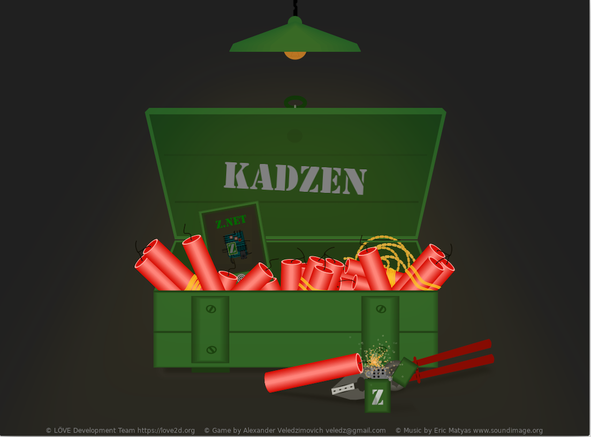
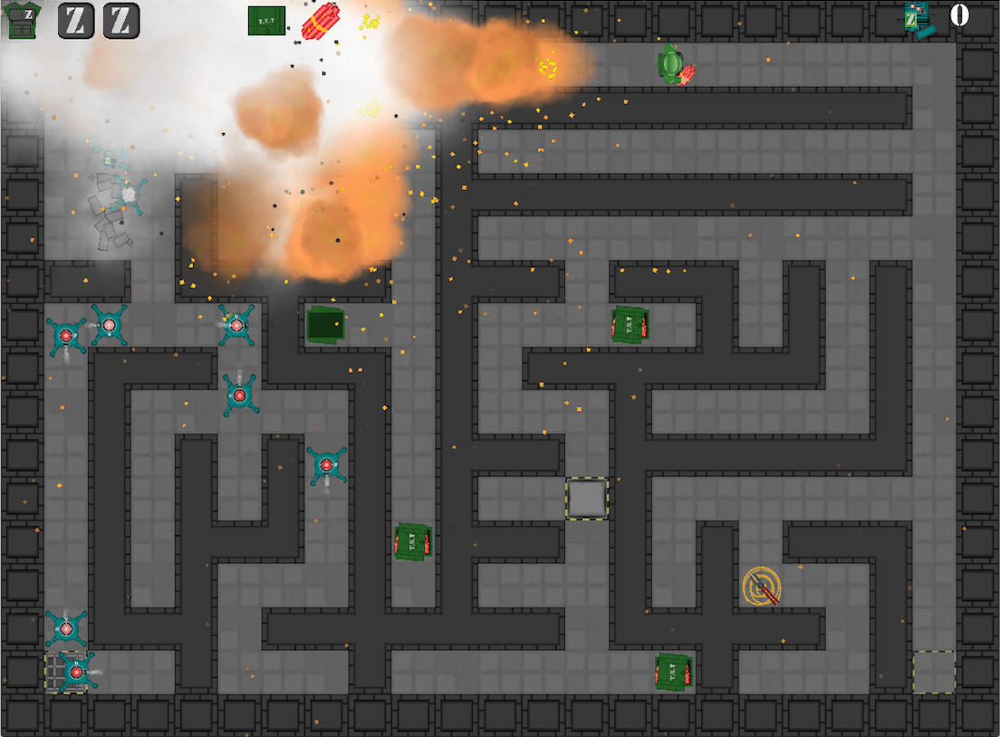
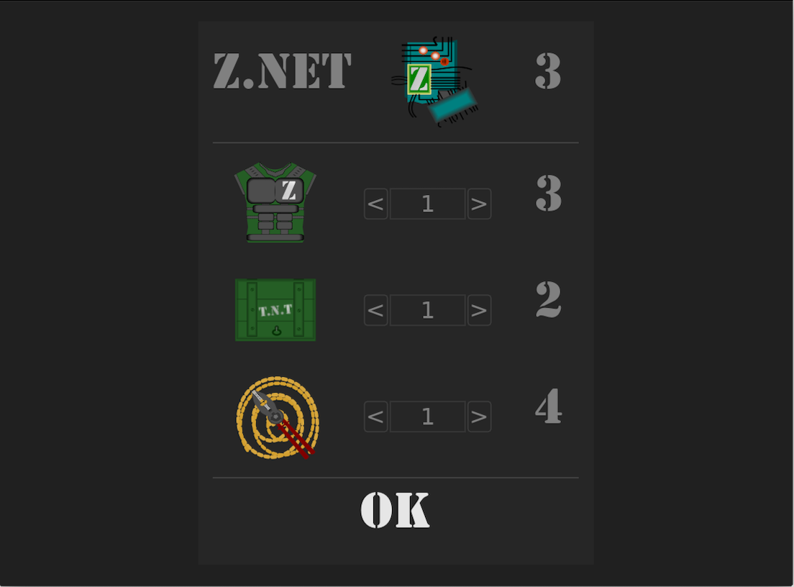
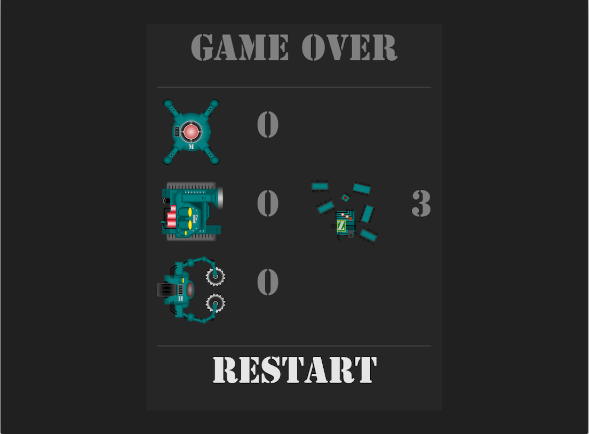

# Kadzen-LÖVE

"Kadzen" is a Shoot Them All game combined with a randomly generated levels.

Goal: Run through the labyrinth. Find a button to open door to the next level. Use TNT to destroy walls and robots. Collect useful items or buy them in Z.NET. More TNT - more FUN!

Controls: 'W' or '↑' - move up, 'A' or '→'' - move right, 'D' '←' - move left, 'S' '↓' - move down, SPACE' - throw TNT.

HINT: Use TNT to destroy door.

Made with Love2d and some self-made libraries on top of Love Engine.

Music by [Eric Matyas](www.soundimage.org)

[Release available for Mac OS 64-bit & for Windows 32-bit](https://github.com/schwarzbox/Kadzen-Love2d/releases)

To run source code: clone repository, download & install [LÖVE 11.1](https://love2d.org) for you system and run kadzen.love.

